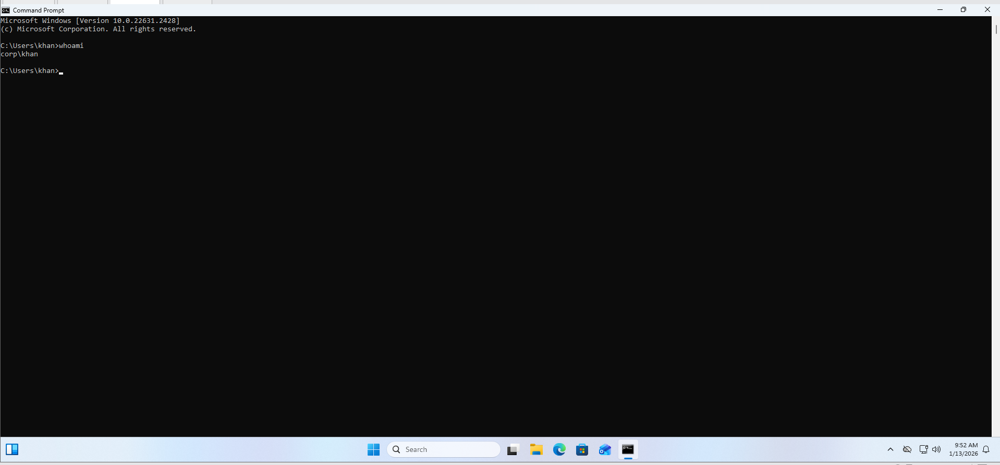
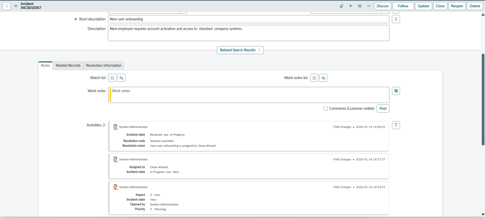
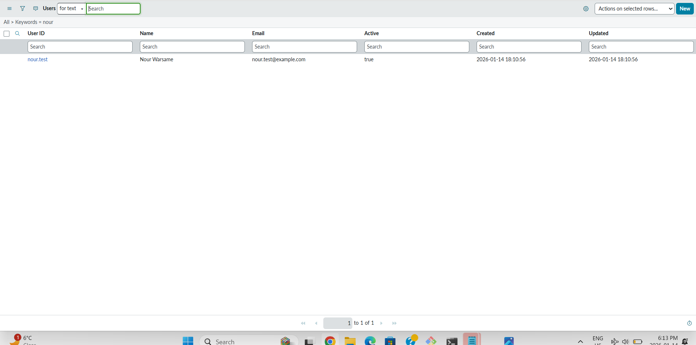
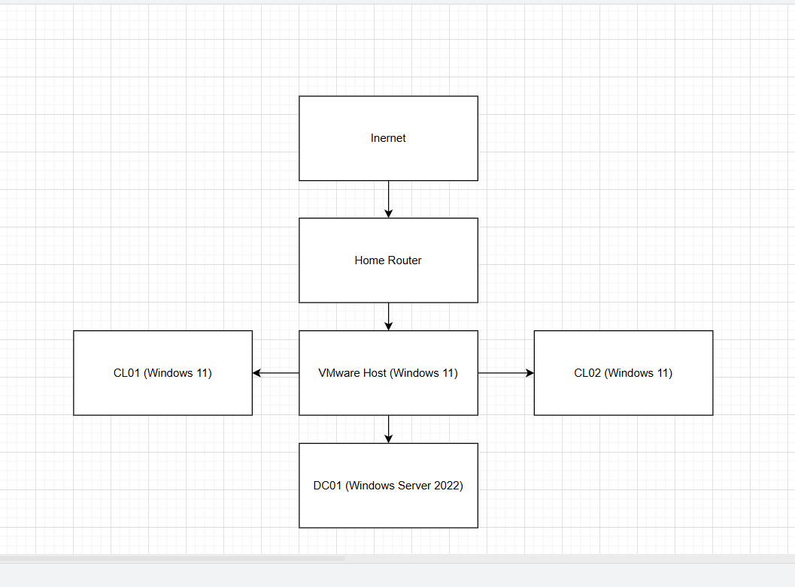

# IT Home Lab Portfolio

## About Me

I am an IT professional with hands-on experience building and managing real-world lab environments. This portfolio demonstrates my practical skills in Active Directory, Microsoft 365 administration, ServiceNow ITSM, and networking using VMware.

## Lab Environment Overview

- VMware Workstation running on Windows 11
- Windows Server 2022 Domain Controller
- Windows 10/11 Client Machines
- Local virtual network simulating a small enterprise environment

## Completed Labs

### 1. Active Directory Domain Lab

- Deployed Windows Server 2022 as a Domain Controller
- Created and managed users, groups, and OUs
- Joined Windows client machines to the domain
- Applied Group Policy Objects (GPOs)
- Configured basic file sharing and permissions

📂 Lab file: `labs/02-active-directory-domain.md`
**Client Machine Login (Domain User)**
Domain-joined Windows client successfully authenticated using Active Directory Credentials.

### 2. Microsoft 365 / MS-102 Lab

- Configured Microsoft 365 tenant
- Managed users and licenses
- Worked with Exchange Admin Center
- Created shared mailboxes
- Reviewed Teams policies and basic security settings

📂 Lab file: `labs/01-microsoft-365-ms102.md`
**Exchange Admin Center – Shared Mailbox Permissions**

### Client Machine Login (Domain User)

### 3. ServiceNow Helpdesk Lab

- Created and managed incidents
- Assigned tickets to technicians
- Updated work notes and resolution status
- Practiced real helpdesk ticket lifecycle
- Followed ITSM best practices

📂 Lab file: `labs/03-servicenow-helpdesk.md`

### 4. Network Topology

- Designed a logical network diagram
- Simulated enterprise-style connectivity:
  - Internet → Home Router → VMware Host
  - Domain Controller and Client Machines connected internally

📂 Network topology diagram included in the `screenshots/network-diagram/`
**Incident Assigned and Resolved (ServiceNow ITSM)**  
Demonstrates full help desk ticket lifecycle from creation to assignment and resolution.

**ServiceNow User List**  
Shows user records used for end-user support and incident handling.

## Tools & Technologies Used

**Home Lab Network Diagram**  
Illustrates the virtual network architecture including domain controller, client machines, and services.
**Home Lab Network Diagram**
Illustrates the virtual network architecture including domain controller, client machines, and services.

- Windows Server 2022
- Windows 10 / Windows 11
- VMware Workstation
- Active Directory
- Group Policy
- Microsoft 365 Admin Center
- ServiceNow
- Basic Networking Concepts
- CMD & PowerShell (basic usage)

## Career Focus

Seeking opportunities in:

- IT Support / Helpdesk
- Junior System Administrator
- Desktop Support
